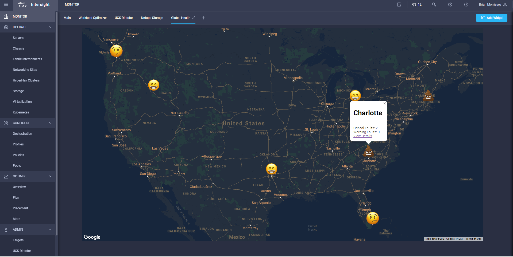

# IntersightHealthMap
Example using Intersight location tags to map faults

# Usage
Step 1 - Tag objects in Intersight with a key value pair such as "Location: Boston" or "Location: Miami".

Step 2 - Add Intersight public API key in .env

Step 3 - Add Intersight secret API key in SecreyKey.txt

Step 4 - Add GCP service account JSON key w/bucket privileges to GoogleSecretKey.json 

Step 5 - Edit google maps api key in index.html

Step 6 - Upload *.html *.css *.png to GCP bucket

Step 7 - Run fetchalarmsformaps.py which will query intersight and upload data.js to the GCP bucket

# File Descriptions
.env  - Intersight API Key 

SecretKey.txt - Intersight API private key

GoogleSecretKey.json - Google Cloud Service Account for uploading data.js to a bucket

intersight_auth.py - Python script to handle Intersight authentication encryption

fetchalarmformaps.py - Python script to query Intersight for faults by location and output javascript variables for use by the map overlay

data.js - File created by fetchalarmformaps.py and subsequently uploaded to a google storage bucket

index.html - map overlay, you must change the google maps api key

style.css - static css page

yellowhealth.png - static marker icon

redhealth.png - static marker icon

greenhealth.png - static marker icon

background.png - static background image
